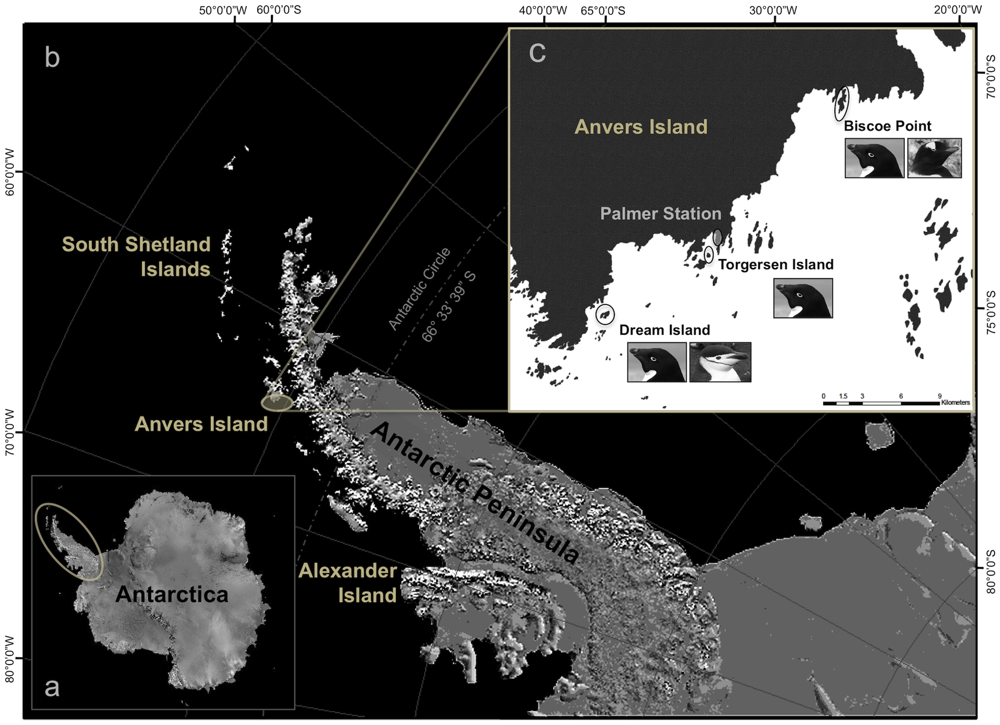

# Skills Learning -- Lecture

We will be working using R Markdown files to save our code or script. An R Markdown file (saved as **'filename.Rmd'**) is a special type of document that lets you combine your R code, results (like tables and plots), and your written explanations all in one place.  

It’s especially useful because it creates a clear, reproducible record of your analysis that you (or others) can easily follow and re-run later. Unlike plain code files, R Markdown helps you communicate your
work like a report, not just as raw code.  

An Rmd consists of intermingled prose (narratives) and code. There are two types of code in an Rmd document: code chunks and inline R code:  

## Rmarkdown structure - code chunk

```{r}

x <- 5  # radius of a circle

```

Now, we can also include the code (or data created), in the body of the document. This is called *inline code*. The radius of the circle is **`r x`.**  

> Useful commands:  
- To "comment out" (make text grey and not run the code): Ctrl + Shift + C  
- To create a new code chunk: Ctrl + Alt + i  
[For more shortcuts, you can follow this link!](https://bookdown.org/yihui/rmarkdown-cookbook/rstudio-shortcuts.html)  

\ 
Alright, let's get started.   

## 0. Load Required Packages

> *Packages* are like apps; functions are like tools inside the app.\

Packages in R are like apps you install on your computer.  
Just like you install Microsoft Word to write documents or Excel to do spreadsheets, in R, you install packages to help you do specific types of tasks — like making graphs (`ggplot2`), cleaning messy data (`janitor`), or analyzing statistics (`stats`).  \

Functions are the tools inside those apps.  
For example, in Microsoft Word, once installed, you can use tools like bold, spellcheck, or insert image.
In an R package like ggplot2, you get tools (functions) like geom_point() to make scatterplots or labs() to add axis labels.\

Example: Think of `tidyverse` as the R version of Microsoft Office: it’s a suite of tools (packages like `dplyr`, `ggplot2`, `readr`, etc.).  

Each package comes with specialized functions — like `filter()` from `dplyr` to filter rows, or `read_csv()` from `readr` to import data.  

```{r, message=FALSE, warning=FALSE}

# install.package("tidyverse")
# install.package("janitor")

# Load tidyverse for data wrangling and visualization
library(tidyverse)

```

In this course, we will use the `penguins` dataset from the `palmerpenguins` package, which is an innate dataset that comes with R. These data contain physical measurements, species info, and other metadata on three penguin species in Antarctica.  

The `penguins` data included in R is fairly clean. We will use the `penguins_raw` data, which includes errors, miscategorizations, and missing data. The idea is that it mimics the type of data you might work with in your research.  

Although you can download it directly from R, we will practice importing the *.csv* file from your working directory.

## 1. Load and Preview the Dataset

```{r}

# check that you are in the correct working directory, the R-Ecology_Workshop folder
getwd()

# If not, set your working directory to the correct folder (e.g., R-Ecology-Workshop), where all of your scripts and data will be saved. For example: 
# setwd("/Users/rsteinitz/Documents/github/R Data Analysis Course")

# Load dataset
data_raw <- read_csv("Week 1/Palmer Penguins Raw.csv")

# Preview the structure
glimpse(data_raw, width = 80) # the 'width' command just limits how much is printed in each line of information. It is mostly helpful when you 'knit' the document to take up less space on the document. 

# glimpse() is a cleaner display that str(), but does the same
str(data_raw)

# notice the number of rows
# the number of columns
# and then the column names and type of data in each (which is determined when R reads in the dataset)

# Print the first few rows
head(data_raw)

# Open the data in a new window
#View(data_raw)

# Let's clean up the column names, which will make it easier to index, or refer to them in functions
data <- janitor::clean_names(data_raw)

# what do they looks like now?
head(data)

# you can also call up just a list of the column names
names(data)

# compare this to the raw data
names(data_raw)

```

> To run a **single** line of code: Ctrl + Enter. Runs the line of code your courses is on. *Give it a try!*  

> `janitor::clean_names()` is a great tool to standardize column names  

...which makes column names easier to use in code. Instead of having to type something like:  
`data$"Flipper Length (mm)"`   
...a "cleaned" version of this name would be:  
`data$flipper_length_mm`  \

- The function `clean_names()` automatically replaces spaces, parentheses, slashes, and symbols with clean underscores. For example, `"Body Mass (g)"` becomes `body_mass_g` — easier to read, write, and autocomplete.  

- Helps avoid bugs! You don’t have to remember to use quotation marks around column names or worry about weird symbols breaking your code.  


## 2. Diagnosing Data Types and Structure

We want to understand what type of variables we’re working with:  
- Are they numeric, character, or factors?
- Are some columns misclassified?

```{r}

# Check data types: 
glimpse(data, width = 80)

# if you want to know what type of data exists in a particular column, you can target it directly:
class(data$island) # character
class(data$date_egg) # character, not date! 
class(data$flipper_length_mm) # numeric (also labeled as "double")

# how many entries (rows) per each category in this variable
table(data$species)

# Information within a column
unique(data$island) # we see that there are 3 unique values that exist in this column
unique(data$flipper_length_mm) # many!!! how do we know how many?
length(unique(data$flipper_length_mm))

# ok, back to the Islands!
unique(data$island) # Torgersen, Biscoe, Dream

# I want to know how many rows of data exist for each 
count(data, island) # count the number of rows for each unique entry in column "island"

# ================================================================================
# Q: so what does 'Biscoe - 168' tell us about the data??
# A: ---> that there are 168 rows of data (out of 344) that were collected on Biscoe Island.
# ================================================================================

count(data, flipper_length_mm) # you can also do this for a variable that has a many more unique entries, but it doesn't really make sense to do so. 

```

## 3. Missing Data: Detection and Summary

Missing data (NA values) are common in real-world datasets. Let’s identify where they exist and how much is missing.

```{r}

# When R reads in a dataset, cells without values will typically be converted to NAs (Not Available or Not Assessed)
# Now let's see if we can find missing data! 
is.na(data$sex)

# ================================================================================
# Q: how many rows with missing sex data are there?
# A: ---> hard to tell, right? 
# ================================================================================


# So this is a good start, but your data set might have THOUSANDS of rows. So this is not an effective way to look at NAs. 

# How many NAs per column?
colSums(is.na(data)) # summarizes a statistic across all columns

# this is also an option per a specific column
sum(is.na(data$flipper_length_mm))

# ================================================================================
# ***Q: TRY FINDING HOW MANY NAs ARE IN A DIFFERENT COLUMN!***
# ================================================================================
# (hint: you will need to call the names of the column, or view the dataset!)
sum(is.na(data$date_egg))

# Summary stats also help us spot missing values, as well as other statistics.
summary(data)


# ================================================================================
# ***Q: So, what does this mean in terms of how we collect and store data????***
# ***A: ---> we want to make sure to keep NAs as empty cells; not put in "0" or "." or "none". Otherwise, R will read in that information as a number or character, which is incorrect representation of that data point. 
# ================================================================================

# ================================================================================
# ***Q: What is the maximum flipper length? 
# ***A: ---> 231
# ================================================================================

# ================================================================================
# ***Q: What is the average, or mean bill depth? 
# ***A: ---> 17.15
# ================================================================================

# ================================================================================
# ***Q: What is the range of values in column 'delta_15_n' 
# ***A: ---> 7.63220 - 10.02544
# ================================================================================
# there's an easier way to find out range: 
range(data$delta_15_n_o_oo)
# uh oh! NA NA??? 
range(data$delta_15_n_o_oo, na.rm = TRUE)  # Some functions can't calculate a result if there are missing values (NAs). na.rm = TRUE means "remove NAs before calculating."

```

> **Suggestion:** In your own dataset, always start with a quick visual and summary check like this. It helps catch early problems in data entry or formatting.

## 4. Convert Column Types (if needed)
Some variables might be stored as character but should actually be treated as **factors** — which are used to represent *categorical variables* (like sex: "male" and "female", or species: "Adelie", "Gentoo", "Chinstrap"). Converting to factors helps R treat them properly in visualizations, summaries, or statistical models (e.g., group comparisons).  

When do we keep them as characters? We keep variables as character when they are text labels or descriptions that are not meant to be grouped or modeled — for example, a column of penguin ID codes or free-text comments, like notes.  

### 4.1 Check class
Let’s check the "sex" column and convert it to a factor if needed:
```{r}

# What type of data is stored in the "sex" column?
class(data$sex) # character

# Convert sex to factor (if not already)
data <- data %>%
  mutate(sex = as.factor(sex))

# so you can convert your data which was miscategorized to its correct class. 

# We're also using something new here: the pipe operator (%>%). You can read it as "and then." It allows us to write our code in a sequence that flows from left to right, instead of nesting functions inside one another.

```

> Shortcut for pipes: Ctrl + Shift + M\ 


R provides various functions for converting between these data types, typically prefixed with `as.`:
`as.numeric()` - Converts to numeric  
`as.integer()` - Converts to integer  
`as.logical()` - Converts to logical  
`as.character()` - Converts to character  
`as.factor()` - Converts to factor  
`as.Date()` - Converts to Date  


## 5. Basic Visualizations for Exploration

Visuals help us catch outliers, understand distributions, and explore relationships.

### 5.1 Histogram of a Numeric Variable
Histograms are plots that show how frequently values fall within certain ranges, helping us understand the distribution of a numeric variable. In ecology, we often use histograms to examine traits like body size, group size, or environmental variables to spot patterns such as skew, outliers, or multimodal distributions.

```{r}

# The easiest way to quickly plot a histogram - a way to look at the distribution of values for a variable:

hist(data$flipper_length_mm)

# Although you can use this format for reports, it is not very appealing, and not quite publication-quality

```

Instead, I prefer to use `ggplot` ('GG' stands for Grammar of Graphics).  
And it is a mini-language within R that we use to create quick, polished, and publication-ready graphs.  

There are a lot of different things you can do with ggplots, and we'll see many examples of these in the coming weeks.  

Every `ggplot` has three core components:  
- **Data** – the dataset being visualized  
- **Aesthetics** (`aes`) – mappings that connect variables to visual properties (like x-axis, y-axis, color)  
- **Geometries** (`geom_`) – the type of plot you want to make (like `geom_point()` or `geom_bar()`).  

### 5.2 Histogram with ggplot
So let's build our first ggplot:
``` {r} 

# Histogram
ggplot(data, aes(x = flipper_length_mm)) +
  geom_histogram(binwidth = 2, fill = "steelblue", color = "white")
# + labs(title = "Distribution of Flipper Length", x = "Flipper Length (mm)", y = "Count")

# Use facet_wrap() to compare distributions across groups.
ggplot(data, aes(x = flipper_length_mm)) +
  geom_histogram(binwidth = 2, fill = "lightblue", color = "black") +
  facet_wrap(~ species) #+
  #labs(title = "Flipper Length by Species", x = "Flipper Length (mm)", y = "Count") +
  #labs(title = "Flipper Length by Species", x = "Flipper Length (mm)", y = "Count")
```


[For the full set of R color names, check out this link!](https://r-charts.com/colors/)

\ 

### 5.3 Bar Plot of a Categorical Variable

```{r}
ggplot(data, aes(x = species)) +
  geom_bar() + # fill is the color inside the bar; color is the outlien
  labs(title = "Number of Penguins per Species", x = "Species", y = "Count")


ggplot(data, aes(x = species)) +
  geom_bar(fill = "coral", color = "brown") + # fill is the color inside the bar; color is the outlien
  labs(title = "Number of Penguins per Species", x = "Species", y = "Count")


ggplot(data, aes(x = species, fill = sex)) +
  geom_bar() + # fill is the color inside the bar; color is the outlien
  labs(title = "Number of Penguins per Species", x = "Species", y = "Count")


```

> **Note:** These are *exploratory* plots. We’re not yet testing hypotheses—just getting familiar with our data’s structure and quirks.


# Skills Application -- Lab 
## 6. Practice Prompts 

Each student should now begin a **new R Markdown file** in the same project and try the following with either their own dataset or a provided one:

If you are working on **your own dataset**, then create a Markdown file to which you will be using and continuously adding. 
- Name it: *Lastname_Firstname_Data*  

If you are working on a **example dataset**, then create a Markdown file just for this week.
- Name it: *Lastname_Firstname_Week1*  

Then, begin the lab activity:
0. Import the dataset into the environment and save as an object. 

1.  Identify which variables have missing values.  

2.  Check for misclassified columns (e.g., text stored as factors, numbers stores as text).

3.  Convert at least one column to the correct type.  

4.  Get summary statistics for two variables of different classes.  

5.  Create one bar plot (categorical variable) and one histogram (numeric variable).  

6.  Add a title and axis labels to each plot.  

7.  Knit the script into an HTML file, which will be saved to your working directory


------------------------------------------------------------------------

## Summary

This week we:  
- Loaded and explored a new dataset  
- Investigated data types and missing values   
- Visualized numeric and categorical variables  
- knitted code into coding documentation  

Next week, we’ll start wrangling our data using `filter()`, `select()`, and `mutate()` from `dplyr`.   


# Optional - additional functions
To explore on your own time, ahead of next week
```{r}

# See which individual records have the most missing data.
# Number of missing values per row
data %>%
  mutate(row_missing = rowSums(is.na(.))) %>%
  arrange(desc(row_missing)) %>%
  head()

# Find out whether certain groups (e.g., sexes or species) are more likely to have missing values.
# Compare missing values in body mass across species
data %>%
  group_by(species) %>%
  summarise(missing_body_mass = sum(is.na(body_mass_g)))

# Customize colors in a bar plot using scale_fill_manual().
ggplot(data, aes(x = species, fill = species)) +
  geom_bar() +
  scale_fill_manual(values = c("darkgreen", "darkorange", "steelblue")) +
  labs(title = "Species Counts (Colored)", x = "Species", y = "Count")

# Use facet_wrap() to compare distributions across groups.
ggplot(data, aes(x = flipper_length_mm)) +
  geom_histogram(binwidth = 2, fill = "lightblue", color = "black") +
  facet_wrap(~ species) +
  labs(title = "Flipper Length by Species", x = "Flipper Length (mm)", y = "Count")

# Look at how many penguins exist per island and species.
# desc() dictates the *descending* order
data %>%
  count(island, species) %>%
  arrange(desc(n))

```

------------------------------------------------------------------------





